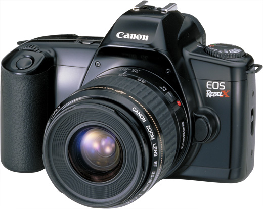
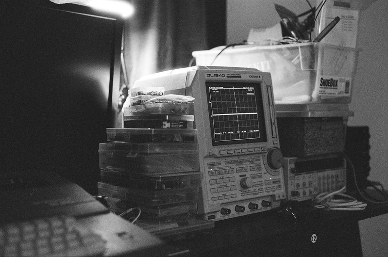
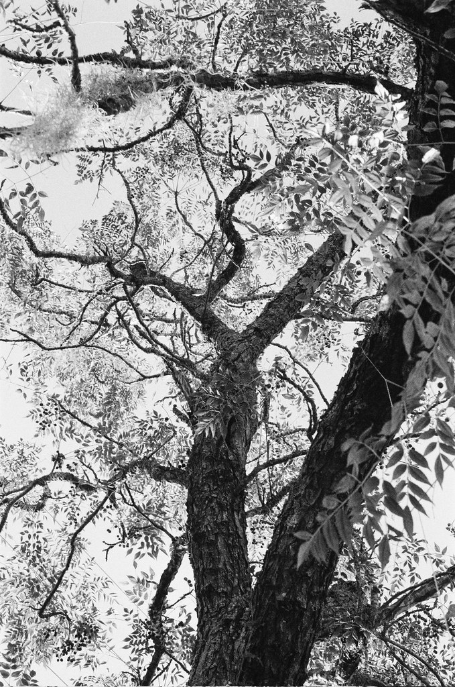

## Equipment, Background, and Other Thoughts

I started out with photography with a passed down Rebel T3. Not the latest or newest, but a perfectly capable sensor, well featured body, and it used the widely supported EF-S Canon mount. It allowed me to get my feet wet with the field, and besides, I've never been one to believe that having the newest, most expensive tool instantly makes you better at anything (to an extent). This applies to photography as well. Beyond quality of life features, a camera is a dark box with light input on one end and a light sensitive element on the other. In terms of image quality, improvements to digital sensors quickly became asymptotic for a casual photographer like me, so I've focused on learning about composition, color correction.

Some time after, I came across a Rebel X SLR for extremely cheap. Most of the used film camera market orbits around a handful of critically acclaimed camera makes and models, and many well featured and advanced cameras tend to lurk in their shade. This specific camera appealed to the exact same market as the other Rebel, sporting an equally well balanced featureset catering to beginners. My favorite part about film is that the technology was essentially perfected by the end of the film era, so a majority of film cameras in the late 90s and early 00s share the exact same technology as DSLRs even to this day. Look at the very first DSLRs to hit the market; they are almost carbon copies of the final SLR models. My Rebel X is compatible with the exact same autofocus and metering system as my much newer DSLR, so it was as smooth of a transition into film as I could've wished for.  

Now that I've gone through my fair share of rolls, I invested into a Pentax KX to learn photography down to a subconscious understanding of creative metering, composing, and to break the habit of treating the camera as a point and shoot. I began working at the film lab, which exposed me to what my peers felt and thought about the analog medium. Being forced to focus, think about what my aperture and shutter speed settings are doing in terms of the frame I am about to campture makes the images much more meaningful and connected to me as a photographer. Ansel Adams did not have the technology that we have within the latest Canon or Nikon flagships, yet he managed to create images so powerful as to encourage the appreciation of the beauty that spans the American continent, and the creation of the National Parks throughout the US. We live in an era where cameras are perpetually within reach in our pockets, yet it's the most disconnected from photography I've felt. Pictures I take on my phone quickly fade into the depths of my camera roll, while the pictures I have taken on film all remain fresh in my psyche as the day I composed the shot through the viewfinder. The cherry on top is that the actual photons my camera saw at that instant are captured chemically to endure the years. Hard drives fail, servers and services shut down, yet grandpa's Kodachrome slides from the 70s have withstood the test of time and will continue to do so. As technology advances, these masters have allowed us to reproduce mind bending quality from movies and TV recordings purely because they were stored chemically on film as opposed to magnetic tape or whatever other alternative. 

Working as a developer with my background in engineering has made me appreciate the work of the thousands of people throughout centuries working to capture their lives. This ramble is a thinly veiled open love letter to the chemists, engineers, and designers at Kodak, Fujifilm, and the thousands of other companies that brought the ability to create snapshots of special moments to the masses. It moves me deeply that more and more people share this sentiment and are powering a film resurgence. I understand the purpose and the niche for digital photography, but the same way that one can choose to write something on paper versus typing it into a Word document, I believe film photography has an equal right to exist in the Internet era. 

On the topic of film photography, I get a little more in depth about the chemistry and construction of photographic film over in my [blog post]() about my time as a film tech and the troubleshooting/repairing of some of our machines. If you've ever sent out a roll to be developed and scanned, it's a good behind-the-scenes view of why there's delays and errors every once in a while. These are machines on life support with limited availability of replacement parts and plenty of lost knowledge from generations of engineers that retired at the beginning of the millenium.

With that out of the way, see some of my favorites below. Thank you for reading.

## My Favorite Recent Shots

 

 
