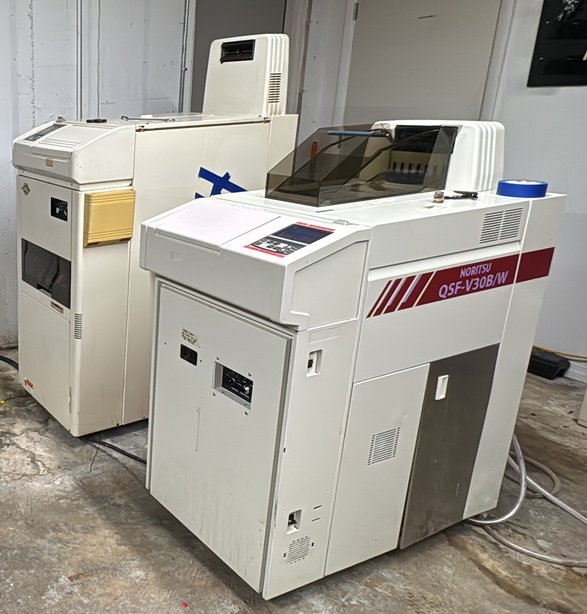
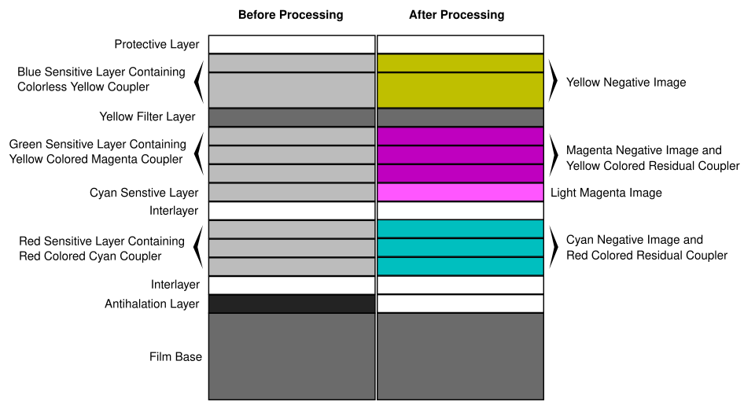
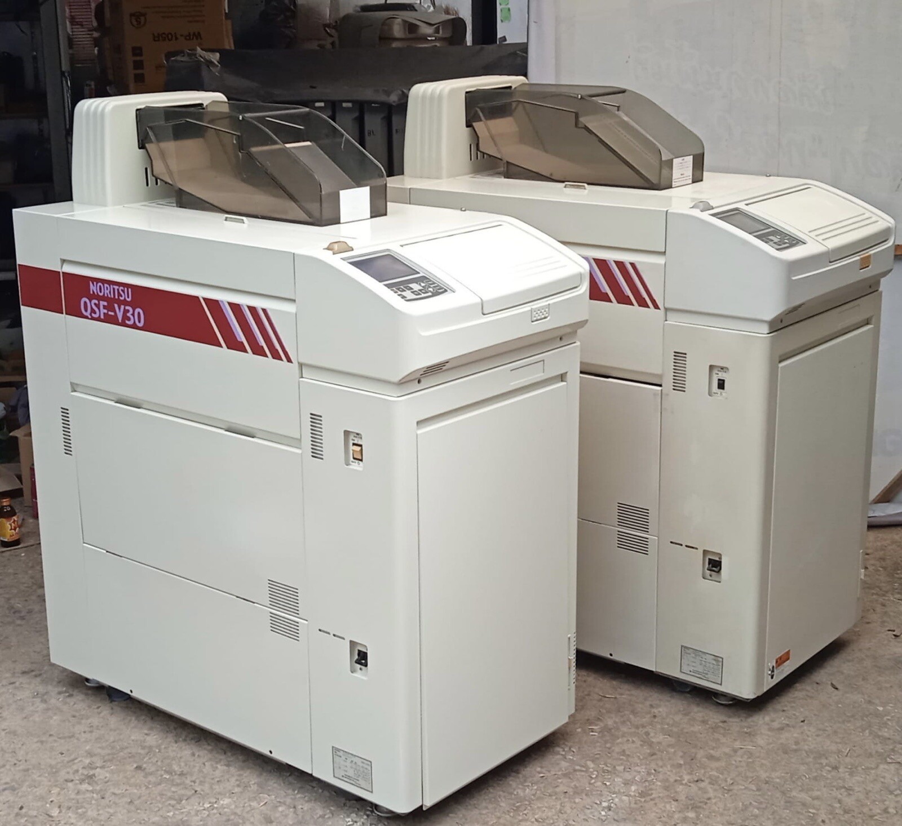
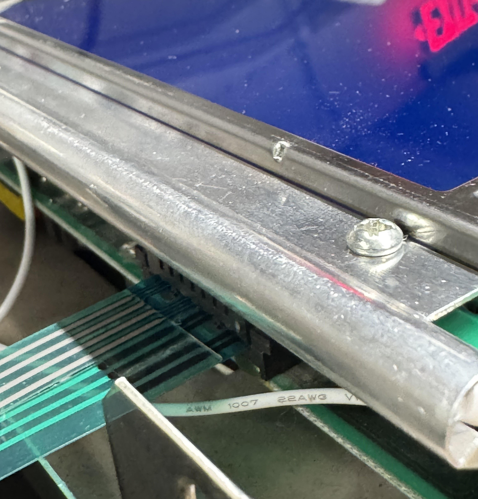
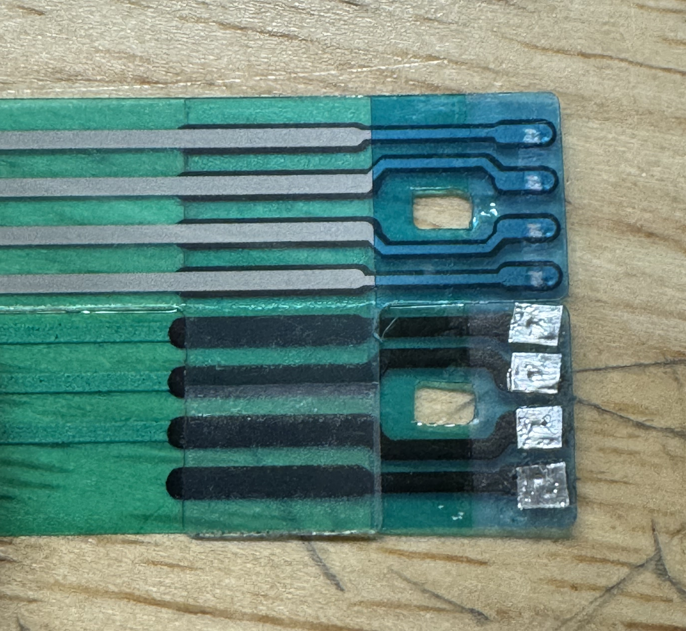
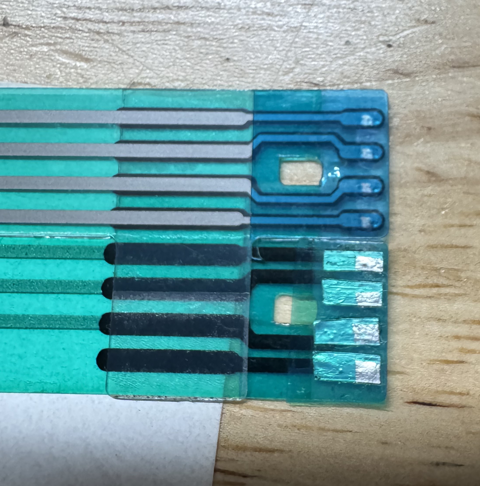
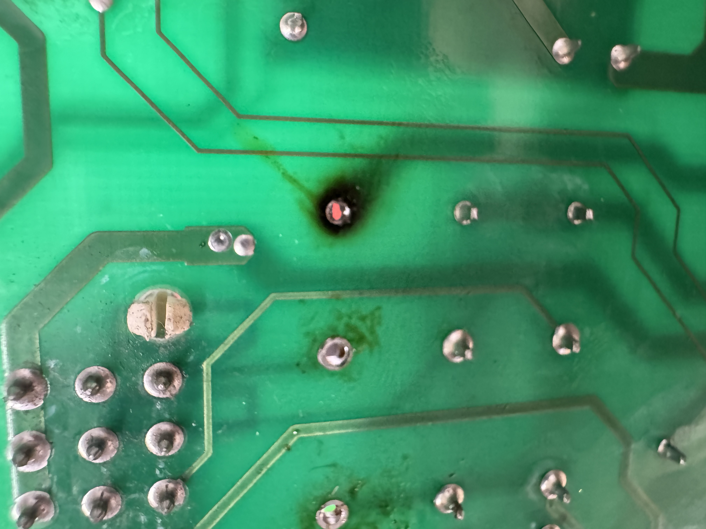

# Background

I've been working at a film lab for the last couple of months, and the engineering degree immediately made itself useful by giving me the tools to keep some of these machines alive. Problems ranging from just corrosion within a sensor's connector to open heart surgery on a board no longer made. For a glorified sous-vide tank, the Noritsu engineers put a lot of safeguards and smart engineering in place to keep these working as well as they have for as long as they have. I'm writing this article with the intention of logging whatever I find for whoever takes over for me, or whoever finds this website in similar despair as I have googled whenever something broke. 

This is the V50, relatively sophisticated MiniLab unit for C-41 Color Development. Short Leader style, which means you tape the film to a sheet of plastic with sprocket holes on it, and that's what drags the film itself out of the can and into each step of the development process. The 50 in V50 stands for 50 rolls an hour, so not too shabby accounting for the fact a 36 exposure roll of film tends to be somewhere around 5 feet. 

In order to put the rest of the machine in context, let's cover the development steps of Black and White and C-41 film:

For both, the film is coated with silver halide crystals. Exactly how they are spread on the film and what they do during and after the development process varies between B/W, C-41, and every other development process available, but the working principle remains the same. After being exposed to light, these crystals are raised to a higher energy level, leaving a latent image stored chemically on the film emulsion.

<strong>B/W</strong>: 
<ol>
<li><strong>Developer</strong>: This step converts the latent image contained in the activated silver halide into metallic silver. This metallic silver only appears in the locations where light struck the emulsion. The stronger the light, the more concentrated the silver, the darker or "denser" the image is at this location, and the reverse applies as well. All of this to say that we now have a negative image of what was captured in the camera at that moment. </li>
<li><strong>Fixer</strong>: After the developer, the image that matters to us is created. However, it's still surrounded by the inactive silver halides still in the emulsion. No light, no developer action, no metallic silver. The fixer can dissolve the halides but not metallic silver, which allows us to selectively remove the unused stuff and keep our image negative.</li>
</ol>

Easy stuff, we've been doing monochrome stuff essentially as long as we have been able to understand organic chemistry. B/W film made a year ago and 80 years ago work the exact same, and excluding the effects of age, can be developed the exact same way. Color, however, is where modernity truly shines through. Kudos to all the chemists and engineers that allowed us to record the world around us in more than shadows and highlights.

<strong>C-41</strong>: 
<ol>
<li><strong>Developer</strong>: Still does the same as B/W, with the caveat that now the dye couplers (part that creates the colors) are activated and create the dyes of each layer. Fun fact, you can cross-process any C-41 roll as B/W, you just ignore the color couplers for a monochrome image. I've managed to salvage pictures from obsolete C-22 rolls from 60+ years ago. Hard drives fail, files go corrupt, but in a decently wide range of conditions, chemistry prevails. Cool stuff.</li>
<li><strong>Bleach</strong>: Due to the layout of a typical C-41 film emulsion, after development, you now have both a dye-based image, and the metallic silver image. Keeping both of these leads to super dense images with low saturation, and often it was used intentionally as a color grading effect in movies and TV in a method called "bleach bypass". The bleach attacks this metallic image and converts it back to silver halides, which can now be removed by the fixer. It also helps reducing the density of the dyes in the film base.
</li>
<li><strong>Fixer</strong>: Same as B/W. Fixer actually holds quite a decent amount of silver, so it's very important to dispose of properly and feed it to silver reclaiming facilities. Not that any other chemical is great for carelessly dumping into the environment, but the fixer carries metals with it that are specially bad to introduce into an ecosystem. 
</li>
<li><strong>Stabilizer</strong>: The dyes contained on each layer are technically not fixed in space, and age, environmental factors, and improper handling of the film can lead to them migrating between layers. The end effect is a reduction in the color reproduction quality, so stabilizers are used to "lock" the dyes out of escaping their layer. You can very well skip this step if you are just looking for a glorified Instagram filter, but in order to produce negatives that can withstand the test of time, stabilization is crucial.</li>
</ol>

I'd love to get into detail about the careful design of color emulsions, but so have another 500 trillion people on the internet, so I will unfortunately not elaborate here. Google it, watch Tech Connections about it, don't use this case of brevity as an excuse to avoid learning about film.

Our machine feeds the leader card and the film it's attached to into a very deep 18 Liter Color Developer (CD) tank at a speed that allows for each length of film to be in contact with the CD solution, while automatically adding a replenishment amount of fresh chemical to account for exhaustion per roll. All the chemicals involved in these reactions are disposable and need to be replenished accounting for the surface area that passes through. The film is continued to be carried in and out of the solutions automagically by careful mechanical design of roller transports like conveyors through a factory. The machine doesn't actually know where this film is, but it vaguely knows when it started being fed and when the canister was cut off at the end, and it knows how fast everything is spinning and moving the film along. So it starts counting and can make an educated guess as to where it'd be and what chemicals would be exhausted at which times. 

At the end, it passes through essentially a gentler air fryer before being released fully dry for it to be scanned and/or sleeved for preservation. Almost magical coming from my background of hanging up film from my shower curtain loops. 

I've neglected to mention much about the modified V30 that develops B/W, but it's the same principles and same tech, just behaving differently to accomodate for the different chemistry. Both operate the same. Now, let's get into it.

## Repair Log

### Most Recent: B/W Intermittent "Bootlooping"

#### Symptoms

- Machine goes into a cycle of booting and self-testing, encountering some error and powering down, then repeating the cycle.

- Initially only happened at the end of a roll, right after cutting the canister off. One reboot cycle and it would continue as normal.

- Progressed to continously turning off and on again.

#### Troubleshooting + False Solution

My initial assumption was an intermittent short in a system related to the springloaded blades that cut the end of the film from the canister. It's a guillotine that's tensioned until it hits a detente to hold the spring securely. When the can is pulled closer as the roll runs out, it hits a paddle that trips the spring catch and the blade flies into the film, cutting it off. The spring is loaded via a motor on a cam, so I started checking that the motor actuated freely, which it did. 

At the beginning of each day, a start check is completed where a leader card is fed through the machine with no film attached to it in order to confirm that there's nothing wrong with the extensive tree of gears and rollers that transports everything from beginning to end. I noticed that during this test the problem still occured, even though the motor was not involved and the cutter was not triggered. It ruled out anything wrong with that subsystem, giving me a dead end. 

Visiting the service manual pointed me to a logic issue with the front panel control board, where I started poking around until I found out through a tech at one of the other labs that something similar happened when the front panel button connection was corroded. Upon cleaning and reseating the cable the problem was fixed. Straight forward enough. 

A couple of months passed and the problem returned, where we'd clean the cable and reseat it, helping for a couple weeks until the issue appeared again. Every cleaning would return everything to normal but the time until the problem reappeared was slowly getting shorter until now.

#### Solution

At this point, it had been several months of increasingly more regular cycling on the ribbon cable. The usual cleaning and reseating got to a point where it did not solve the issue at all, the machine could not be used at all. When I took it apart and inspected the ribbon cable under a loupe I found that the contact material had fully worn through, and I presume it wasn't making contact at all. I unfortunately did not take a picture of the damage before the first fix, but looking at the picture below, the untouched side shows the gist of it. The contacts on the board wore a hole through the pads.

<li><strong>Version 1</strong> </li>

We were pretty backed up in terms of black and white orders, so I needed to get the machine to stop cycling and begin processing film. I had the idea of using aluminum tape from one of the film stocks we sell. They make their DX codes by sticking some aluminum tape and putting a label over it in order to make the pattern of conductive/non-conductive squares. Pretty neat. Turned out pretty sloppy but it got the job done to catch up with orders. Let's call this one Version 1.0

Unfortunately, some of the buttons were intermitently working, so I knew we couldn't keep this for the long term. We had ordered some X-Acto knives so I figured I'd redo the patchwork with sharper blades whenever those came in. Version 1.1 turned out more aesthetically pleasing but actually gave its own set of issues. For example, the set of buttons that were acting up with 1.0 returned to life, but a different set did not work at all and in fact ended up sticking and led the machine to behave erratically. This told me that I was now shorting adjacent pads to one another or to ground around the connector body. At this point I realized the tape we use for taping the film to the leader cards was pretty perfect as a low-temp Kapton tape alternative and the idea for V2 was born.

<li><strong>Version 2</strong> </li>

For V2 I had two major conclusions driving how I went about this next repair. First, I needed to shield everything besides the actual contact point in order to prevent any more shorting. I was very lucky I didn't fry anything that last time. I also needed to have better contact between the original flex PCB traces and the aluminum tape, so I needed to flip the aluminum tape in order to keep the glue from acting as an insulator. 

By stenciling the actual location of the worn contacts onto some tape, I was able to shield everything else and it made the size, shape and location of my aluminum tape squares less critical. I was also able to stick them onto the bottom of the tape and rinse off the adhesive from it with some alcohol. It took me the longest out of all the solutions I came up with but at this point it's the closest I've gotten to a permanent fix short of replacing the board altogether. 

### Color Developer Working Tank Overheating

#### Symptoms

- Intermitent S-Sol Thermo Activated Error

- Solution reaches 43C before other safeguards kick in

- Initially only happened during overnight sleep cycle

#### Initial Troubleshooting

- Compared thermocouple readings to thermometer in working tank and in side tank (will elaborate on tank layout in a second)
-- Temp Matches

- Drained tank, cleaned agitation and recirculation pumps
-- Minor to Negligible Improvement

For context, we had just recovered from the below problem of the cutter jamming, so at this point we had been chasing problems around for around a month.

Preventative maintenance is crucial for keeping old hardware like this up and running. Much like one of my old bosses used to say: "Schedule the maintenance or the machine will schedule it for you"

Going back to the problem, at first the heater would behave but over time it started getting stuck powered on during normal operation and not just during the overnight sleep mode. When we confirmed that the machine was reading the correct temperature for the tank, it indicated to me that a relay was getting stuck closed intermittently. Still, it's a team project and the rest of the team wanted to confirm nothing else was out of the ordinary before ruling in favor of swapping the relay. I didn't work for a couple days so the rest of the team limped the machine through and only took 3 day turnaround orders. 

I took a quick brush through the service manual and found that the stabilizer control system and the one for the tank giving us problems was the exact same, so I swapped its thermocouple and heater, making the machine believe that the stabilizer was the color dev tank and viceversa. The heater loops all were controlled via components labeled SSR1 through 7, all on the power board at the bottom of the machine. Unsurprisingly, the stabilizer was now overheating instead. Luckily, we could run the stabilizer at room temperature so disabling the color developer heater could let us run the machine and catch up with orders before a repair needs to be done. I reset the thermostat for the stabilizer to what it needed to be for color developer (remember that color dev is now stabilizer from the point of view of the machine and viceversa), and then set the color developer temperature to zero so it would not attempt to power anything on that circuit. The machine slowly got up to temperature and remained there as it was now able to turn off the color developer heater.

 

At this point we caught up with orders for the most part, so I carried on with trying to fix the root cause. When I came back to the machine, I noticed that although the troubleshooting LEDs on the power board showed the control unit was not powering the heater relay, temperature continued to climb. From my car background I had the intuition to begin tapping around every black relay-looking box with the rubber back of a screwdriver. It didn't help. 

Turns out SSR stands for Solid State Relay, something I realized pretty late, embarassingly late. SSRs tend to fail closed as they're semiconductor devices, and it confirmed and explained my initial assumption of a stuck relay. The awesome engineers at Noritsu had the foresight of including redundant relays on the board, or rather, populating relay footprints for heater circuits not used in this machine model. I'm sure the V100 or the V5Billion use these relays, but I'm lucky mine doesn't because these exact P/Ns are looooooong discontinued. In my panic before realizing there were spares I did find a suitable drop-in replacement. I crossreferenced the info on the part itself, the pin pitch from the board and the specs from the service manual. Part number is D2W203F-11 and below are some links to find a replacement in case you're not so lucky to have extras:

[Digikey](https://www.digikey.com/en/products/detail/sensata-crydom/D2W203F-11/139583)
[Mouser](https://www.mouser.com/ProductDetail/Crydom/D2W203F-11?qs=mNyg5qXQ%2FscFP3eDV%2F5phw%3D%3D)

Closely inspecting the board would've saved a bit of time, but it wasn't easy to get out of the machine and I didn't want to take it out unless absolutely necessary. These things are a couple grand each. 

 

A candidate for the world's oldest solder was holding the relay in place, so a ton of flux, time and patience were needed to get it out and replaced with the extra. The pad was fried to begin with, and I presume that solder started cracking and creating a high resistance connection. The thermal cycling probably also weakened the joint and created a feedback loop culminating where we are now.  

 

After it was all said and done, I gave the board a good dusting and a rinse with isopropyl alcohol to wash of the flux all over the board and give it some TLC. Once installed, the heater problem was solved and it's still powering through orders to this day. 

### Cutter Jams

#### Symptoms
- Right Lane Struggled to Cut Canister at the End of the roll
- Canisters stuck after cutting
- Cutter Return Error

#### Initial Troubleshooting

Initially, 

## Film Chemistry Experiments

### C-41 Reversal

### Black and White Reversal
